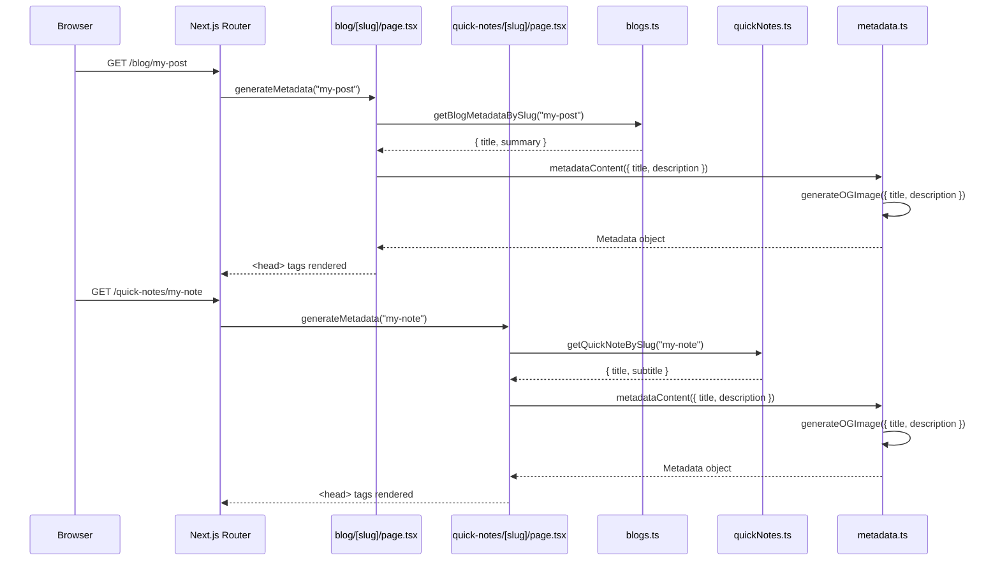

# Architecture

> Auto-generated from the GitNexus knowledge graph (183 symbols, 292 relationships, 6 functional areas, 2 execution flows). Last indexed: 2026-03-09.

## Overview

**yehezgun-v5** is a content-driven personal portfolio website built with Next.js 16 (App Router), TypeScript, and Tailwind CSS + DaisyUI. Content is authored in MDX files, compiled at build time via Content Collections, and served through a layered architecture of services, components, and pages.

### Codebase Stats

| Metric | Value |
|--------|-------|
| Indexed files | 104 |
| Code symbols | 183 |
| Relationships | 292 |
| Functional areas | 6 |
| Execution flows | 2 |

## High-Level Architecture Diagram

```mermaid
graph TB
    subgraph Content["Content Layer"]
        MDX_Blogs["content/blogs/*.mdx"]
        MDX_Projects["content/projects/*.mdx"]
        MDX_Notes["content/quick-notes/*.mdx"]
        MDX_Exp["content/work-experiences/*.mdx"]
    end

    subgraph CC["Content Collections"]
        CC_Config["content-collections.ts"]
        CC_Blogs["allBlogs"]
        CC_Projects["allProjects"]
        CC_Notes["allQuickNotes"]
        CC_Exp["allWorkExperiences"]
    end

    subgraph Services["Services Layer"]
        SVC_Blogs["blogs.ts"]
        SVC_Projects["projects.ts"]
        SVC_Notes["quickNotes.ts"]
        SVC_Exp["experiences.ts"]
        SVC_Meta["metadata.ts"]
        SVC_Date["formatDate.ts"]
    end

    subgraph Constants["Constants"]
        CONST_Base["baseConst.ts"]
        CONST_Menu["menuList.ts"]
        CONST_Footer["footerMenuList.ts"]
        CONST_Social["socialMedia.ts"]
    end

    subgraph Components["UI Components"]
        COMP_Layout["GeneralWrapper / Header / Footer / MobileBottomNav"]
        COMP_Blog["BlogWrapper / BlogCard / ClientMDXContent"]
        COMP_Project["ProjectCard / FeaturedProjectCard"]
        COMP_Notes["QuickNotesWrapper / QuickNotesCard"]
        COMP_Exp["ExperienceCard"]
        COMP_Share["ShareButtonFlex / ShareBtns"]
        COMP_Theme["CustomTheme / ImageWithLightbox / SyntaxComponent"]
        COMP_Mermaid["MermaidWrapper / MermaidInit"]
        COMP_Giscus["ClientGiscus"]
    end

    subgraph Pages["App Router Pages"]
        PAGE_Home["/ (Home)"]
        PAGE_Blog["/blog"]
        PAGE_BlogSlug["/blog/[slug]"]
        PAGE_Projects["/projects"]
        PAGE_Notes["/quick-notes"]
        PAGE_NoteSlug["/quick-notes/[slug]"]
        PAGE_About["/about"]
        PAGE_Resume["/resume"]
    end

    subgraph Context["React Context"]
        CTX_Theme["ThemeProvider"]
    end

    %% Content -> Content Collections
    MDX_Blogs --> CC_Config
    MDX_Projects --> CC_Config
    MDX_Notes --> CC_Config
    MDX_Exp --> CC_Config
    CC_Config --> CC_Blogs & CC_Projects & CC_Notes & CC_Exp

    %% Content Collections -> Services
    CC_Blogs --> SVC_Blogs
    CC_Projects --> SVC_Projects
    CC_Notes --> SVC_Notes
    CC_Exp --> SVC_Exp

    %% Services -> Components
    SVC_Blogs --> COMP_Blog
    SVC_Date --> COMP_Blog
    SVC_Date --> COMP_Exp
    SVC_Blogs --> COMP_Layout
    SVC_Projects --> PAGE_Home

    %% Services -> Pages (metadata)
    SVC_Meta --> PAGE_Home
    SVC_Meta --> PAGE_Blog
    SVC_Meta --> PAGE_BlogSlug
    SVC_Meta --> PAGE_Projects
    SVC_Meta --> PAGE_Notes
    SVC_Meta --> PAGE_NoteSlug
    SVC_Meta --> PAGE_About

    %% Components -> Pages
    COMP_Layout --> PAGE_Home & PAGE_Blog & PAGE_BlogSlug & PAGE_Projects & PAGE_Notes & PAGE_NoteSlug & PAGE_About
    COMP_Blog --> PAGE_Blog & PAGE_BlogSlug
    COMP_Project --> PAGE_Projects
    COMP_Notes --> PAGE_Notes & PAGE_NoteSlug
    COMP_Exp --> PAGE_About
    COMP_Share --> PAGE_BlogSlug & PAGE_NoteSlug
    COMP_Theme --> PAGE_BlogSlug & PAGE_NoteSlug
    COMP_Mermaid --> PAGE_BlogSlug
    COMP_Giscus --> PAGE_BlogSlug

    %% Constants -> Components
    CONST_Menu --> COMP_Layout
    CONST_Footer --> COMP_Layout
    CONST_Social --> PAGE_About
    CONST_Base --> COMP_Giscus

    %% Context
    CTX_Theme --> PAGE_Home
```



## Functional Areas

The knowledge graph identified 6 functional areas (communities) using the Leiden algorithm. Below are the major areas and their members.

### 1. Services (Core Data Layer)

**Cohesion: 1.0** | **5 symbols**

The backbone of the application. Handles data retrieval from Content Collections, date formatting, and SEO metadata generation.

| Symbol | File | Role |
|--------|------|------|
| `getBlogBySlug` | `src/services/blogs.ts` | Fetch single blog post by slug |
| `getBlogMetadataBySlug` | `src/services/blogs.ts` | Fetch blog metadata for SEO |
| `formatDate` | `src/services/formatDate.ts` | Date formatting utility |
| `metadataContent` | `src/services/metadata.ts` | Generate Next.js Metadata objects |
| `generateOGImage` | `src/services/metadata.ts` | Generate Open Graph image URLs |

**Key callers:** Every page route imports `metadataContent`. Blog and experience components depend on `formatDate`. Dynamic slug pages use `getBlogBySlug`.

### 2. Services (Page Rendering)

**Cohesion: 0.86** | **4 symbols**

Page-level components that orchestrate data fetching and rendering for dynamic routes.

| Symbol | File | Role |
|--------|------|------|
| `SingeBlogPage` | `src/app/blog/[slug]/page.tsx` | Blog post detail page |
| `generateMetadata` | `src/app/blog/[slug]/page.tsx` | Blog SEO metadata generation |
| `BlogCard` | `src/components/BlogCard.tsx` | Blog list item card |
| `ExperienceCard` | `src/components/ExperienceCard.tsx` | Work experience card |

### 3. Quick Notes Area

**Cohesion: 0.8** | **3 symbols**

Handles the quick notes content type end-to-end.

| Symbol | File | Role |
|--------|------|------|
| `SingleNotePage` | `src/app/quick-notes/[slug]/page.tsx` | Note detail page |
| `generateMetadata` | `src/app/quick-notes/[slug]/page.tsx` | Note SEO metadata |
| `getQuickNoteBySlug` | `src/services/quickNotes.ts` | Fetch single note by slug |

### 4. Blog Components (Interactive)

**Cohesion: 1.0** | **3 symbols**

Client-side interactive components for the blog listing page.

| Symbol | File | Role |
|--------|------|------|
| `BlogWrapper` | `src/components/BlogWrapper.tsx` | Blog list with category filter |
| `blogCategories` | `src/services/blogs.ts` | Available blog categories |
| `handleChangeCategory` | `src/components/BlogWrapper.tsx` | Category filter handler |

### 5. Share Components

**Cohesion: 1.0** | **3 symbols**

Social sharing functionality for blog posts and notes.

| Symbol | File | Role |
|--------|------|------|
| `ShareButtonFlex` | `src/components/ShareButtonFlex.tsx` | Share button container |
| `ShareBtns` | `src/components/ShareBtns.tsx` | Individual share buttons |
| `handleClick` | `src/components/ShareButtonFlex.tsx` | Share action handler |

## Key Execution Flows

The knowledge graph traced 2 execution flows through the codebase:

### Flow 1: Blog Metadata Generation (intra-community)

Triggered when Next.js generates metadata for a blog post page.

```
Step 1: generateMetadata()          [src/app/blog/[slug]/page.tsx:21]
   │    Fetches blog metadata by slug via getBlogMetadataBySlug()
   ▼
Step 2: metadataContent()           [src/services/metadata.ts]
   │    Builds Next.js Metadata object with title, description, OG tags
   ▼
Step 3: generateOGImage()           [src/services/metadata.ts:9]
        Constructs Open Graph image URL for social previews
```

### Flow 2: Quick Notes Metadata Generation (cross-community)

Same pattern but for quick notes, crossing from the [slug] community into the Services community.

```
Step 1: generateMetadata()          [src/app/quick-notes/[slug]/page.tsx:17]
   │    Fetches note metadata by slug via getQuickNoteBySlug()
   ▼
Step 2: metadataContent()           [src/services/metadata.ts]
   │    Builds Next.js Metadata object
   ▼
Step 3: generateOGImage()           [src/services/metadata.ts:9]
        Constructs Open Graph image URL
```

### Metadata Flow Diagram



## Dependency Map

### Call Graph (27 relationships)

The most interconnected symbols by call count:

| Symbol | Incoming Calls | Outgoing Calls | Role |
|--------|---------------|----------------|------|
| `metadataContent` | 8 (all pages) | 1 (`generateOGImage`) | Central metadata hub |
| `formatDate` | 3 (BlogCard, ExperienceCard, SingeBlogPage) | 0 | Pure utility |
| `getBlogBySlug` | 2 (SingeBlogPage, tests) | 0 | Data accessor |
| `getQuickNoteBySlug` | 2 (SingleNotePage, generateMetadata) | 0 | Data accessor |
| `blogCategories` | 2 (BlogWrapper, tests) | 0 | Category list |

### Import Graph (79 relationships)

Most imported modules:

| Module | Imported By | Type |
|--------|-------------|------|
| `GeneralWrapper.tsx` | 8 pages | Layout wrapper |
| `metadata.ts` | 7 pages | SEO service |
| `content-collections.ts` | 5 services | Data source |
| `formatDate.ts` | 3 components | Utility |
| `blogs.ts` | 3 pages + BlogWrapper | Blog data |
| `projects.ts` | 2 pages | Project data |
| `quickNotes.ts` | 2 pages | Notes data |
| `menuList.ts` | 2 components (Header, MobileBottomNav) | Navigation |
| `baseConst.ts` | 2 (layout, ClientGiscus) | Config constants |

## Content Collections Schema

Four MDX collections defined in `content-collections.ts`, validated with Zod:

| Collection | Directory | Transform | Key Fields |
|------------|-----------|-----------|------------|
| `blogs` | `content/blogs/` | MDX compilation (remark-gfm, rehype-slug, rehype-raw) | title, summary, coverImg, date, category |
| `quickNotes` | `content/quick-notes/` | MDX compilation (same plugins) | title, subtitle, date, tags |
| `projects` | `content/projects/` | None (raw schema) | name, description, url, stacks, isFeatured |
| `workExperiences` | `content/work-experiences/` | None (raw schema) | title, company, startDate, endDate |

## Testing Architecture

Tests mirror the source structure under `src/__test__/`:

| Test File | Tests | Coverage |
|-----------|-------|----------|
| `services/blogs.test.ts` | `getBlogBySlug`, `getBlogMetadataBySlug`, `blogCategories` | Blog data layer |
| `services/formatDate.test.ts` | `formatDate` | Date formatting |
| `services/metadata.test.ts` | `metadataContent`, `generateOGImage` | SEO metadata |
| `services/quickNotes.test.ts` | `getQuickNoteBySlug`, `getQuickNotesMetadataBySlug` | Notes data layer |
| `services/projects.test.ts` | Project services | Project data |
| `services/experiences.test.ts` | Experience services | Experience data |
| `pages.test.tsx` | All page components render | Page smoke tests |
| `GeneralWrapper.test.tsx` | Layout wrapper rendering | Layout component |
| `FeaturedProjectCard.test.tsx` | Project card rendering | UI component |
| `ImageWithLightbox.test.tsx` | Lightbox rendering | UI component |
| `ThemeProvider.test.tsx` | Theme context | Context provider |

## Deployment

- **Platform**: Cloudflare Pages via OpenNext adapter
- **Config**: `wrangler.jsonc` + `open-next.config.ts`
- **Analytics**: Umami (self-hosted), configured via `baseConst.ts`
- **Comments**: Giscus (GitHub Discussions), configured via `baseConst.ts`
