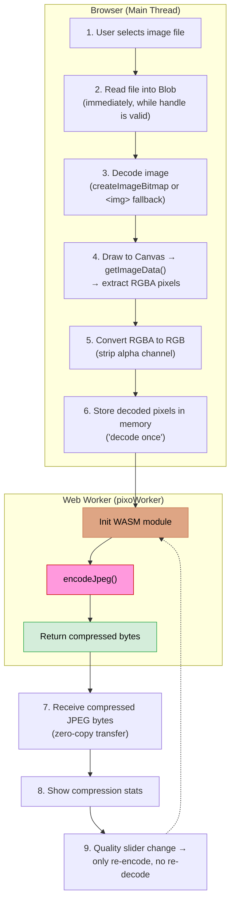

> This is not a comprehensive WASM tutorial. It's more of a practical walkthrough based on my experience integrating a Rust library into a web app through WebAssembly. I hope it can give you a picture of how this actually works.

## Table of contents

- [Introduction](#introduction)
- [What is WebAssembly (WASM)?](#what-is-webassembly-wasm)
- [How Rust Code Becomes WASM](#how-rust-code-becomes-wasm)
- [Real Example: Pixo](#real-example-pixo)
- [How I Integrated Pixo WASM in My Image Compressor App](#how-i-integrated-pixo-wasm-in-my-image-compressor-app)
- [Step by Step: Using a Rust WASM Library in Your Web App](#step-by-step-using-a-rust-wasm-library-in-your-web-app)
- [Performance: Why Bother With WASM?](#performance-why-bother-with-wasm)
- [Why It Doesn't Always Work on Mobile](#why-it-doesnt-always-work-on-mobile)
- [Closing](#closing)
- [References](#references)

## Introduction

If you've read my previous blog about [First Time Trying Rust](/blog/first-time-trying-rust), you know that I've been exploring Rust for a while. Back then, it was mostly about learning the syntax and getting used to the compiler. But one question kept bugging me: "How can I actually utilize Rust in my web app?"

The answer turned out to be **WebAssembly (WASM)**.

I recently built a simple image compression web app called [img-compress](https://github.com/yehezkielgunawan/img-compress) that uses two compression engines: one with the standard HTML Canvas API, and another one powered by [Pixo](https://github.com/leerob/pixo) which is a Rust-based image compression library compiled to WASM. This experience taught me a lot about how Rust and the web can work together, and I want to share it here.

## What is WebAssembly (WASM)?

Before we go further, let's quickly understand what WASM actually is. WebAssembly is a binary instruction format that runs in the browser at near-native speed. Think of it as a "compilation target" that languages like Rust, C, C++, and Go can compile to, so their code can run inside a web browser alongside JavaScript.

The key things to understand:

- **It's not a replacement for JavaScript.** WASM works alongside JS. Your JS code calls WASM functions, and WASM returns results back.
- **It's fast.** Because WASM is a low-level binary format, the browser can execute it much faster than regular JavaScript for CPU-intensive tasks.
- **It's portable.** The same `.wasm` file runs on any browser that supports WebAssembly (which is basically all modern browsers today).

Here's the simplified mental model:


So in short, you write your performance-critical logic in Rust, compile it to WASM, and call it from your JavaScript/TypeScript code like a normal function. The browser handles the rest.

## How Rust Code Becomes WASM

This is the part that I find fascinating. The process of turning Rust code into something your web app can use involves several steps. Let me break it down:


Here's what happens at each step:

1. **Write Rust code** - You write your library in Rust using `wasm-bindgen` to mark which functions should be exposed to JavaScript.
2. **Compile to WASM** - Rust supports a compilation target called `wasm32-unknown-unknown` (which you install via `rustup target add`). When you compile with this target, it produces a `.wasm` binary file instead of a native executable.
3. **Generate JS bindings** - A tool called `wasm-bindgen` generates the JavaScript glue code (`.js`) and TypeScript type definitions (`.d.ts`) that let you import and call the WASM functions as if they were regular JS functions.
4. **Import in your web app** - You import the generated JS module in your app, call an `init()` function to load the `.wasm` file, and then you can call the Rust functions directly.

The build commands typically look like this:

```bash
# Install the WASM target
rustup target add wasm32-unknown-unknown

# Install wasm-bindgen CLI
cargo install wasm-bindgen-cli

# Build the WASM module
cargo build --target wasm32-unknown-unknown --release --no-default-features --features wasm

# Generate JS bindings
wasm-bindgen --target web \
  --out-dir ./output-dir \
  --out-name my_lib \
  target/wasm32-unknown-unknown/release/my_lib.wasm
```

After this process, you'll get output files like:

- `my_lib.js` - The JS glue code
- `my_lib.d.ts` - TypeScript type definitions
- `my_lib_bg.wasm` - The actual WASM binary
- `my_lib_bg.wasm.d.ts` - WASM type definitions

## Real Example: Pixo

Now let's talk about a real library. [Pixo](https://github.com/leerob/pixo) is a minimal-dependency, high-performance image compression library written in Rust by [Lee Robinson](https://leerob.com). What makes it special:

- **Zero runtime dependencies** - All encoding algorithms are implemented from scratch in Rust
- **PNG and JPEG support** - Lossless PNG, lossy PNG (quantization), and lossy JPEG
- **Small WASM binary** - Only around 159 KB which is very small for what it does
- **Well-tested** - 86% code coverage with 965 tests

Pixo exposes a clean WASM API with just 3 functions:

```typescript
// Encode image as PNG
encodePng(
  data: Uint8Array,    // raw pixel data
  width: number,
  height: number,
  colorType: number,   // 0=Grayscale, 2=Rgb, 4=GrayscaleAlpha, 6=Rgba
  preset: number,      // 0=fast, 1=balanced, 2=max
  lossy: boolean
): Uint8Array

// Encode image as JPEG
encodeJpeg(
  data: Uint8Array,    // raw pixel data
  width: number,
  height: number,
  colorType: number,
  quality: number,     // 1-100
  preset: number,
  subsampling420: boolean
): Uint8Array

// Get bytes per pixel for a color type
bytesPerPixel(colorType: number): number
```

That's it. Give it raw pixels, tell it the dimensions and quality, and it gives you back compressed image bytes. Clean and simple.

## How I Integrated Pixo WASM in My Image Compressor App

I built [img-compress](https://github.com/yehezkielgunawan/img-compress), a client-side image compression web app using Hono + Vite + Cloudflare Workers. The app has two compression engines and I want to share how the Pixo WASM integration actually works.

### The Architecture

Here's how the Pixo WASM page works end-to-end:



The key insight here is the **"decode once, compress many"** pattern. Decoding the image (turning the file into raw pixels) is expensive. But once you have the pixels, you can re-encode them at different quality levels cheaply. So when the user moves the quality slider, only the WASM encoder runs again, not the entire decode pipeline.

### The WASM Files

After building Pixo with the WASM target, I got these files and placed them in `src/utils/pixo-wasm/`:

```directory
src/utils/pixo-wasm/
├── pixo.js           # JS glue code (auto-generated)
├── pixo.d.ts         # TypeScript types (auto-generated)
├── pixo_bg.wasm      # The actual WASM binary (~155 KB)
└── pixo_bg.wasm.d.ts # WASM type definitions
```

### Using Pixo in Code

Here's the simplified version of how I call Pixo in my app. First, I import the generated bindings:

```typescript
import initPixo, { encodeJpeg } from "./utils/pixo-wasm/pixo";
```

Then, I initialize WASM (this loads the `.wasm` file) and call the encoder:

```typescript
// Initialize WASM - only needs to happen once
await initPixo();

// Encode RGB pixels as JPEG
const jpegBytes = encodeJpeg(
  rgbPixelData, // Uint8Array of RGB pixel data
  width, // image width
  height, // image height
  2, // color_type: Rgb
  quality, // 1-100
  1, // preset: balanced
  true, // subsampling_420 (chroma subsampling)
);

// Create a Blob from the result
const compressedBlob = new Blob([new Uint8Array(jpegBytes)], {
  type: "image/jpeg",
});
```

One important thing: Pixo expects **RGB** data (3 bytes per pixel), but the Canvas `getImageData()` API returns **RGBA** data (4 bytes per pixel). So I had to strip the alpha channel before passing it to Pixo:

```typescript
const rgbaToRgb = (rgba: Uint8ClampedArray): Uint8Array => {
  const pixelCount = rgba.length / 4;
  const rgb = new Uint8Array(pixelCount * 3);
  for (let i = 0, j = 0; i < rgba.length; i += 4, j += 3) {
    rgb[j] = rgba[i]; // R
    rgb[j + 1] = rgba[i + 1]; // G
    rgb[j + 2] = rgba[i + 2]; // B
    // skip rgba[i + 3] which is Alpha
  }
  return rgb;
};
```

### Running WASM in a Web Worker

One thing I learned is that you should **not** run WASM encoding on the main thread if you care about UI responsiveness. The encoding can take hundreds of milliseconds for large images, and that will freeze your UI.

I used a Web Worker to run the Pixo encoder off the main thread:

```typescript
// pixoWorker.ts - runs in a separate thread
import initPixo, { encodeJpeg } from "./utils/pixo-wasm/pixo";

let pixoReady: Promise<void> | null = null;

self.onmessage = async (e: MessageEvent) => {
  const { rgb, width, height, quality } = e.data;

  // Lazy WASM init (cached within worker lifetime)
  if (!pixoReady) {
    pixoReady = initPixo().then(() => undefined);
  }
  await pixoReady;

  // Encode with Pixo
  const jpegBytes = encodeJpeg(rgb, width, height, 2, quality, 1, true);

  // Transfer the result back (zero-copy)
  const buffer = new Uint8Array(jpegBytes).buffer;
  self.postMessage({ jpegBytes: buffer }, [buffer]);
};
```

And from the main thread, I call the worker like this:

```typescript
const encodeInWorker = (
  rgb: Uint8Array,
  width: number,
  height: number,
  quality: number,
): Promise<Blob> => {
  return new Promise((resolve, reject) => {
    const worker = new Worker(new URL("./pixoWorker.ts", import.meta.url), {
      type: "module",
    });

    worker.onmessage = (e) => {
      worker.terminate();
      resolve(
        new Blob([new Uint8Array(e.data.jpegBytes)], {
          type: "image/jpeg",
        }),
      );
    };

    worker.onerror = (err) => {
      worker.terminate();
      reject(new Error(err.message));
    };

    worker.postMessage({ rgb, width, height, quality });
  });
};
```

The pattern here is **create a worker, send work, get result, terminate**. It's simple and it works. Most modern browser engines (V8, SpiderMonkey) cache compiled WASM modules after the first fetch, so re-creating workers typically doesn't re-compile the WASM from scratch — though this caching behavior is an implementation detail that may vary across browsers. There's also a main-thread fallback in case Web Workers are not available (like on some older browsers or strict CSP environments).

## Step by Step: Using a Rust WASM Library in Your Web App

If you want to try integrating a Rust WASM library into your own project, here's the general workflow:

### 1. Get the WASM Build Artifacts

If the library already provides pre-built WASM files (like Pixo does), just grab them. You'll typically get:

- `.js` - JavaScript glue code
- `.d.ts` - TypeScript definitions
- `_bg.wasm` - The WASM binary

If not, you'll need to build from source (requires Rust installed):

```bash
rustup target add wasm32-unknown-unknown
cargo install wasm-bindgen-cli

cargo build --target wasm32-unknown-unknown --release --features wasm
wasm-bindgen --target web --out-dir ./wasm-output target/wasm32-unknown-unknown/release/library_name.wasm
```

### 2. Place Files in Your Project

Copy the generated files into your project. I put them in `src/utils/pixo-wasm/` but you can put them anywhere that makes sense for your project structure.

### 3. Configure Your Bundler

If you're using Vite (which I recommend), WASM files are handled out of the box. The bundler will serve the `.wasm` file and the JS glue code handles loading it.

For Webpack, you might need additional configuration or plugins like `wasm-pack-plugin`.

### 4. Import and Initialize

```typescript
import init, { someFunction } from "./path-to-wasm/library";

// Initialize WASM (loads the .wasm file)
await init();

// Now you can call the exported functions
const result = someFunction(inputData);
```

### 5. Handle the Data Conversion

This is the part that usually trips people up. WASM works with raw bytes, not with high-level JS objects. So you need to:

- Convert your JS data to the format WASM expects (usually `Uint8Array`)
- Convert the WASM output back to whatever your app needs (Blob, string, etc.)

In my case, I had to:

1. Decode the image file to raw pixels using Canvas API
2. Convert RGBA to RGB (strip alpha)
3. Pass RGB bytes to Pixo
4. Wrap the returned JPEG bytes in a Blob for download

## Performance: Why Bother With WASM?

You might be wondering, "Is it really worth the effort?" Let me share my perspective.

For my image compressor app, I have two engines side by side: Canvas API (pure JS) and Pixo WASM (Rust). The Canvas API approach uses `canvas.toBlob()` which delegates encoding to the browser's built-in JPEG encoder. Pixo implements its own JPEG encoder entirely in Rust.

The key benefits of WASM approach:

- **Consistent quality** - The Pixo encoder produces the same output regardless of the browser, while Canvas API results can vary between Chrome, Firefox, and Safari
- **More control** - You can tune specific encoding parameters that the Canvas API doesn't expose
- **Portability** - The `.wasm` binary itself runs anywhere that supports WebAssembly — browsers, Node.js, Deno, and Cloudflare Workers. Note that the JS glue code generated by `wasm-bindgen` is target-specific (e.g., `--target web` vs `--target nodejs`), so you may need separate builds for different runtimes

Where WASM really shines is for **CPU-bound tasks** that JavaScript is naturally slow at: image/video processing, cryptography, physics simulations, audio processing, and so on. If your task is mostly I/O-bound or simple DOM manipulation, WASM probably won't help much.

## Why It Doesn't Always Work on Mobile

WASM itself is well-supported on mobile browsers. But the surrounding workflow, specifically reading files, decoding images, and managing memory, is where things break. I learned this the hard way while building img-compress. Here are the real issues I ran into and the workarounds I had to build.

### File Handles Go Stale Between Async Operations

This was the most frustrating bug. On mobile browsers (especially iOS Safari), a `File` object from an `<input>` can become **unreadable** if you try to access it in a later event-loop turn. The browser may release the underlying file data across async boundaries (such as between a user gesture and a subsequent `useEffect`), even though the `File` object itself still exists in memory.

The fix: read the file into memory **immediately** in the same event handler, before any async boundaries:

```typescript
const handleFileSelect = async (selectedFile: File): Promise<void> => {
  // Read into memory NOW while the handle is guaranteed valid.
  // Mobile browsers can invalidate File handles between async ops.
  const buffer = await selectedFile.arrayBuffer();
  const blob = new Blob([buffer], { type: selectedFile.type });

  // Now use blob for everything — it never goes stale.
  const pixels = await extractPixels(blob);
  // ...
};
```

Same goes for the decode step. In my Pixo page, I initially had pixel extraction in a `useEffect`. It worked fine on desktop but silently failed on mobile. Moving everything inline into the handler fixed it.

### Canvas Memory Limits Cause Silent Crashes

Mobile devices have **much stricter memory budgets** than desktops. According to [MDN](https://developer.mozilla.org/en-US/docs/Web/HTML/Reference/Elements/canvas#maximum_canvas_size), exceeding the maximum canvas dimensions or area renders the canvas unusable — drawing commands silently stop working. iOS Safari capped canvas size at **4096 x 4096 pixels** (max area ~16.7 MP) for years; as of iOS 18.0 this was raised to **8192 x 8192** (~67 MP area), but older devices still have the smaller limit. On top of that, total canvas memory across all canvases is capped at roughly 384 MB on iOS.

I had to implement a progressive retry strategy:

```typescript
const DECODE_MAX_DIMENSIONS = [4096, 2048, 1024] as const;

const extractPixels = async (data: Blob): Promise<DecodedPixels> => {
  const decoded = await decodeImage(data);

  for (const maxDim of DECODE_MAX_DIMENSIONS) {
    const { width, height } = calculateScaledDimensions(
      originalWidth, originalHeight, maxDim,
    );
    try {
      const canvas = document.createElement("canvas");
      canvas.width = width;
      canvas.height = height;
      const ctx = canvas.getContext("2d");
      if (!ctx) throw new Error("Failed to get canvas context");

      ctx.drawImage(decoded.source, 0, 0, width, height);
      const imageData = ctx.getImageData(0, 0, width, height);
      const rgb = rgbaToRgb(imageData.data);

      // Free canvas memory immediately
      canvas.width = 0;
      canvas.height = 0;

      return { rgb, width, height, originalWidth, originalHeight };
    } catch (err) {
      // OOM or canvas limit hit — try next smaller dimension
      if (maxDim === DECODE_MAX_DIMENSIONS.at(-1)) throw err;
    }
  }
};
```

Each halving of the max dimension reduces memory usage by **4x**, so falling from 4096 to 2048 is a big win. Also notice the `canvas.width = 0; canvas.height = 0;` at the end. This explicitly releases the canvas memory right away instead of waiting for garbage collection.

### `createImageBitmap` is Unreliable on Mobile

`createImageBitmap` is the modern way to decode images off the main thread. On desktop it works great. On mobile, there are a few gotchas:

- **Resize options support varies** — while `resizeWidth` and `resizeHeight` are supported on iOS Safari 15+ and modern Chrome, the `resizeQuality` option behavior can still be inconsistent across browsers. Older iOS versions (before 15) don't support resize options at all
- **Mobile Chrome** can choke on HEIF/HEIC images that some phones capture by default — these images may not decode correctly through `createImageBitmap` even if the OS can display them natively
- The call can fail silently or throw on stale file handles

My solution was a two-step fallback chain, avoiding resize options to keep behavior consistent across all browsers:

```typescript
const decodeImage = async (data: Blob) => {
  // Step 1: createImageBitmap with NO options (mobile Safari compat)
  try {
    const bitmap = await createImageBitmap(data);
    return { source: bitmap, width: bitmap.width, height: bitmap.height };
  } catch {
    // Fall through
  }

  // Step 2:  element via Object URL (universally supported)
  const url = URL.createObjectURL(data);
  const img = new Image();
  img.src = url;
  await img.decode();
  return { source: img, width: img.naturalWidth, height: img.naturalHeight, objectUrl: url };
};
```

The `` fallback is slower but works everywhere. Good enough.

### Web Workers Can Fail on Mobile Too

Module workers (`type: "module"`) are supported on most modern mobile browsers (iOS Safari 15+, Chrome 80+), but strict Content Security Policy (CSP) environments can still block worker creation entirely via the `worker-src` directive. Edge cases with older browsers or WebView contexts can also cause failures. If the worker fails, you need a main-thread fallback:

```typescript
try {
  blob = await encodeInWorker(rgb, width, height, quality);
} catch {
  // Worker failed — fall back to main-thread encoding.
  blob = await encodeOnMainThread(rgb, width, height, quality);
}
```

Yes, main-thread encoding will freeze the UI briefly. But it's better than showing an error and doing nothing.

### Very Large Images Just Won't Work

Images above ~20 megapixels can exceed mobile per-tab memory limits entirely. There's no workaround for this other than downscaling aggressively (which the progressive retry handles to some degree) or telling the user to use a smaller image. Desktop browsers can generally handle much larger images thanks to more available memory, but mobile browsers might crash the tab well before that threshold.

## Closing

Using Rust libraries through WASM in web apps is no longer a niche thing. The tooling has matured, the browser support is universal, and the performance benefits are real for the right use cases.

My main takeaway from this experience: **WASM is not a replacement for JavaScript, but a powerful complement for performance-critical code.** You don't need to rewrite your entire app in Rust. Just identify the CPU-heavy parts, find (or write) a Rust library for that specific task, compile to WASM, and call it from your JS code.

If you're curious, you can check out my image compressor app at [img-compress.yehezgun.com](https://img-compress.yehezgun.com). The source code is available at [github.com/yehezkielgunawan/img-compress](https://github.com/yehezkielgunawan/img-compress). Try the Pixo page (`/pixo`) to see WASM in action.

And if you want to try Pixo yourself, check the official playground at [pixo.leerob.com](https://pixo.leerob.com).

## References

- [Pixo - High-performance image compression library written in Rust](https://github.com/leerob/pixo)
- [Pixo WASM Guide](https://docs.rs/pixo/latest/pixo/guides/wasm/index.html)
- [MDN WebAssembly Docs](https://developer.mozilla.org/en-US/docs/WebAssembly)
- [wasm-bindgen Documentation](https://rustwasm.github.io/docs/wasm-bindgen/)
- [My Image Compressor App (img-compress)](https://github.com/yehezkielgunawan/img-compress)
