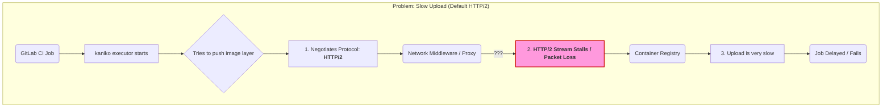
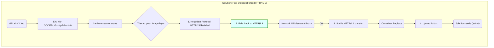

## Introduction

Have you ever experienced a situation where your CI/CD pipeline takes forever to complete? Like, you just want to deploy a simple one-line fix, but you have to wait for almost an hour just for the build and deploy process to finish? Yeah, I've been there.

Recently, I encountered this frustrating issue in my workplace. Our frontend services had extremely slow build and deploy processes using Kaniko in GitLab CI. Simple changes that should take a few minutes were taking up to an hour. It was killing our productivity and making deployments feel like a chore.

After some investigation, I found out that the fix was literally just **one line of code**. Let me share what I discovered.

## The Problem

So here's the context. We were using [Kaniko](https://github.com/GoogleContainerTools/kaniko) to build container images in our GitLab CI pipeline. Kaniko is a great tool for building container images in environments that can't easily or securely run a Docker daemon, like Kubernetes clusters.

The issue was that the image push process was painfully slow. The build itself was fine, but when it came to pushing the image to the container registry, it would hang for a very long time.


## Root Cause Analysis

After digging through GitLab issues and forums, I stumbled upon [this GitLab issue](https://gitlab.com/gitlab-org/gitlab/-/issues/241996) that explained the root cause.

The culprit? **HTTP/2 network issues**.

Turns out, HTTP/2 has some known issues when it comes to pushing large container images to registries. The multiplexing feature of HTTP/2, which is usually a performance benefit, can sometimes cause problems with large file uploads and slow network conditions.

The workaround suggested was to disable HTTP/2 and fallback to HTTP/1.1 for the image push process.

## The One-Line Fix

The fix is surprisingly simple. You just need to set the `GODEBUG` environment variable to disable the HTTP/2 client:

```yaml
variables:
  GODEBUG: "http2client=0"
```

That's it. Just add this one line to your `gitlab-ci.yml` file in the variables section, and you're good to go.

Here's a more complete example of how it looks in a typical GitLab CI configuration:

```yaml
variables:
  APPNAME: "your-app-name"
  NODE_VERSION: 20.18.3
  GODEBUG: "http2client=0"
  ADDITIONAL_FLAGS: "--single-snapshot --compressed-caching=false"
```

## The Result

The impact was immediate and dramatic. After adding the `GODEBUG` variable, our build and deploy time was reduced by approximately **80%**.


What used to take around an hour now completes in just a few minutes. The pipeline became much more responsive, and our team's productivity improved significantly.

## How HTTP/2 vs HTTP/1.1 Works

For those who are curious about why this works, here's a quick explanation.

**HTTP/2** introduced several features designed to improve performance:
- **Multiplexing**: Multiple requests can be sent over a single connection simultaneously
- **Header compression**: Reduces overhead for repeated headers
- **Server push**: Server can send resources before the client requests them

However, these features can sometimes backfire in specific scenarios, like pushing large binary blobs to container registries. The multiplexing can cause issues with flow control and congestion management, especially on networks with high latency or packet loss.

**HTTP/1.1**, while older and simpler, handles large file uploads more predictably. By setting `GODEBUG="http2client=0"`, we're telling Go's HTTP client (which Kaniko uses) to fall back to HTTP/1.1, avoiding the HTTP/2 issues entirely.

## Under The Hood

To make it clearer, here's a visual representation of what happens behind the scene.

### Before: The Slow Upload (Default HTTP/2) [Scrollable]



When using the default HTTP/2 protocol, the kaniko executor tries to push the image layer to the container registry. However, due to network middleware or proxy issues, the HTTP/2 stream can stall or experience packet loss, causing the upload to be very slow or even fail.

### After: The Fast Upload (Forced HTTP/1.1) [Scrollable]



By setting the `GODEBUG` environment variable to disable HTTP/2, the kaniko executor falls back to HTTP/1.1. This results in a more stable transfer through the network middleware, leading to a fast and successful upload.

## Key Takeaways

Here are some lessons I learned from this experience:

1. **Don't always assume the latest protocol is the best** - HTTP/2 is generally faster, but not always. Sometimes older protocols work better for specific use cases.

2. **Small changes can have huge impacts** - One line of code reduced our deployment time by 80%. Never underestimate the power of configuration tweaks.

3. **Read the issue trackers** - When you encounter a problem, chances are someone else has already faced it. GitLab, GitHub issues, and Stack Overflow are goldmines of solutions.

4. **Infrastructure optimization matters** - As I mentioned in my [2025 recap](/blog/my-2025-recap), sometimes one line of infrastructure code can bring more value than fancy UI features. ROI talks louder than technical complexity.

> The best code is often the code you don't write. But when you do write it, make sure it counts.

## Conclusion

This experience reinforced something I've been learning throughout my career: understanding the underlying technology matters. If I hadn't dug into why Kaniko was slow and just accepted it as "that's how it is", our team would still be waiting hours for deployments.

If you're facing similar issues with Kaniko builds, try adding the `GODEBUG` variable. It might just save you hours of waiting time.

## References
- [GitLab Issue #241996 - Slow Kaniko pushes](https://gitlab.com/gitlab-org/gitlab/-/issues/241996)
- [Kaniko GitHub Repository](https://github.com/GoogleContainerTools/kaniko)
- [HTTP/2 Wikipedia](https://en.wikipedia.org/wiki/HTTP/2)